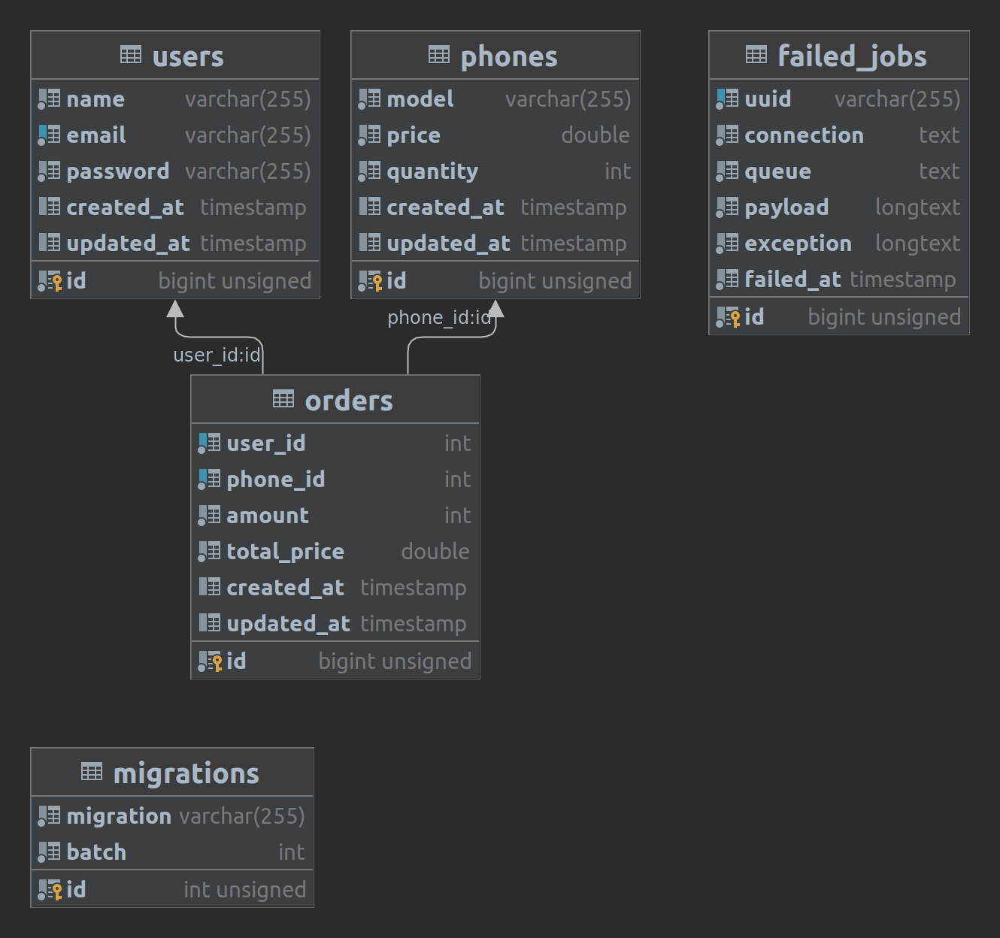

# Backend API for phone sales web-site.

## 1. HTTP requests.

In file 'api.php' was described all HTTP requests to the backend and their responses.

In file 'ApiController.php' was developed mostly used functions to support API
requests.

## 2. Send all orders in CSV format to owners emails.

In file 'SendOrdersToOwners.php' was developed all logic that format the data
from MySql to CSV, then it calls 'DataToOwners.php' mailer which send all CSV
data to owners.

## 3. Customers information.

I was using the simple data:

1. User name;
2. User email;
3. Phone number;
4. Password

## 4. DataBase structure.

## 5. Commands

How to set up project:

1. First of all we need to install composer `composer install`.
2. Then run: `php artisan sail:install` and select `mysql, redis`;
3. In the `.env`, you can set up the database variables;
4. If you need to change ports of `mysql` and `redis`, you can go to the
`docker-compose.yml`, `.env`  and change them to what you need.
5. Then run `./vendor/bin/sail up -d`. It will create containers of your 
application.
6. After the containers was created, you should run this command 
`./vendor/bin/sail artisan migrate --seed`. It will create tables and insert 
data into them.
7. If you want to try to send the orders data to your own email, you can run
this command `./vendor/bin/sail artisan create:admin`.
8. To test the CSV email report:
`./vendor/bin/sail artisan cron:send` or `./vendor/bin/sail artisan schedule:run`.

